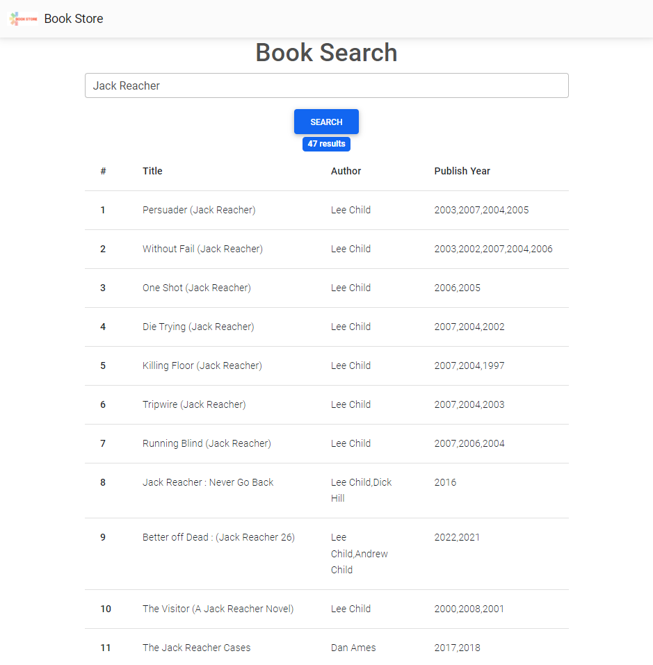
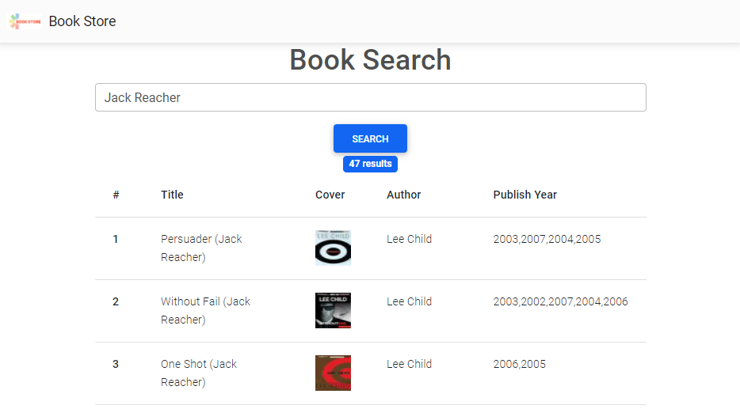

# sm-evaluation / Book Store / Story #1: Search for books 

**As** a user, **I want to** search for books by their names in the book store, **so that** I can see what is available.  

## Acceptance Criteria
1. Call API to get the books by name. Use the already existing input box as book name input.
2. Extend the current book search page to contain search results. Remember about:
  * search button
  * count of search results under the search button
  * table with results (with columns: count of result row, title, author, publish year)
  
  Page should look like this: 

## Technical details
Use the following API: https://openlibrary.org/dev/docs/api/search

Example call:
    
    http://openlibrary.org/search.json?title=Jack+Reacher

## Extra
Add a book cover to the result row (*Hint: https://openlibrary.org/dev/docs/api/covers*)

